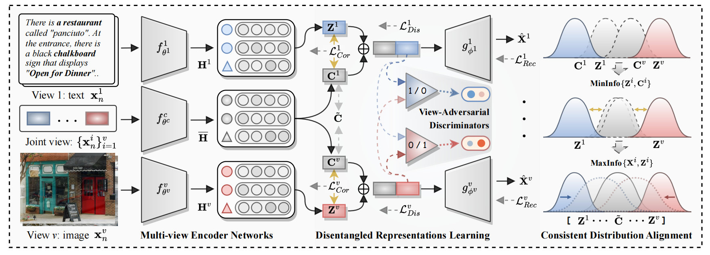

# GMAE
## **[TPAMI 2026✨]**  **Learning Disentangled Representations for Generalized Multi-view Clustering** 🚀

<p align="center">
  <a href="https://github.com/obananas">Xin Zou</a>, 
  <a href="https://github.com/cleste-pome">Ruimeng Liu</a>, 
  <a href="https://github.com/changtang">Chang Tang</a>, 
  <a href="https://github.com/guanyuezhen">Zhenglai Li</a>, 
  <a href="https://github.com/xinwangliu">Xinwang Liu</a>, 
  <a href="">Kunlun He</a>, 
  <a href="">Wanqing Li</a>
</p>

<p align="center">
</p>
<p align="center">
  <a href="">
    
  </a>
</p>

<p align="center">
The flowchart of our proposed Generalized Multi-view Auto-Encoder (GMAE), a framework designed to preserve cross-view complementarity through
disentangled representation learning.
</p>

### 🔗 Citation
If our paper or code inspires you, please cite this paper (early access now)😊:
```
@article{zstarmeng2026gmae,
  author={Xin, Zou and Ruimeng, Liu and Chang, Tang and Zhenglai, Li and Xinwang, Liu and Kunlun, He and Wanqing, Li},
  journal={IEEE Transactions on Pattern Analysis and Machine Intelligence}, 
  title={Learning Disentangled Representations for Generalized Multi-view Clustering}, 
  year={2026},
  doi={10.1109/TPAMI.2026.3687339}
}
```

### ⌨️ Source code list: 

```shell
GMAE-Github
├── 1.logs_classification # 分类任务的日志与图像文件
├── 2.imgs_classification 
├── 1.logs_clustering # 聚类任务的日志与图像文件
├── 2.imgs_clustering 
├── dataset # 数据集存放目录
├── utils # 辅助功能的工具包
│ ├── dataloader.py # 数据集加载与预处理
│ ├── Logger.py # log文档打印
│ ├── metric.py # 评价指标计算
│ ├── plot.py # 绘制评价指标表格和图像
├── classification.py # 多视图分类主程序
├── clustering.py # 多视图聚类主程序
├── loss.py # 损失函数（部分）定义
├── models.py # 模型定义
└── external # 外部库
```

## 1. 📊Dataset
It can be got from: https://github.com/wangsiwei2010/awesome-multi-view-clustering

## 2. ✅Run
(1) To run the **multi-view clustering** task, use the following command:

```shell
python clustering.py
```

(2) To run the **multi-view classification** task, use the following command:

```shell
python classification.py
```

## 🧮3. Main Code

### 3.1 Configuration

This section defines the paths for saving logs, images, and the dataset, along with the device configuration for training.

```py
# Path to save logs
parser.add_argument('--logs_path', default='1.logs_classification', type=str, help='Path to save logs')
# Path to save images
parser.add_argument('--imgs_path', default='2.imgs_classification', type=str, help='Path to save imgs')
# Dataset folder path
parser.add_argument('--folder_path', default='dataset', type=str, help='Dataset folder path')
# Whether to plot the results during training
parser.add_argument('--do_plot', default=True, type=bool, help='Whether to plot the results')
# Device to use for training (e.g., GPU or CPU)
parser.add_argument('--device', default='cuda:0', type=str, help='Device to use for training')
```

### 3.2 Hyperparameters

This section defines hyperparameters related to the training process, such as the number of epochs, learning rate, and other essential parameters.

```py
# Number of training epochs
parser.add_argument('--train_epoch', default=500, type=int, help='Number of training epochs') 
# Interval for evaluation
parser.add_argument('--eval_interval', default=10, type=int, help='Interval for evaluation')
# Random seed for reproducibility
parser.add_argument('--seed', default=42, type=int, help='Random seed for initialization')
# Learning rate for optimizer
parser.add_argument('--lr', default=0.001, type=float, help='Learning rate for optimizer')
# Feature dimensions
parser.add_argument('--feature_dim', default=128, type=int, help='Feature dimensions')
# Regularization for mutual alignment loss
parser.add_argument('--lambda_ma', default=0.01, type=float, help='Lambda for mutual alignment loss')
# Regularization for contrastive loss
parser.add_argument('--lambda_con', default=0.01, type=float, help='Lambda for contrastive loss')
# Number of positive samples for training
parser.add_argument('--pos_num', default=21, type=int, help='Positive sample number')
# Whether to use contrastive loss
parser.add_argument('--do_contrast', default=True, type=bool, help='Whether to use contrastive loss')
```

### 3.3 Dataset Preprocessing

The dataset preprocessing implements the following functions: misaligned views, random views with missing values, and random views with noise.

```py
# Select samples based on the noise ratio, then randomly select (1 to view-1) views to add Gaussian noise.
parser.add_argument('--ratio_noise', default=0.0, type=float, help='Noise ratio')
# Select samples based on the conflict ratio, then randomly replace the data of one view with the same view data from a sample of another category.
parser.add_argument('--ratio_conflict', default=0.0, type=float, help='Conflict ratio')
# Select samples based on the missing ratio, then randomly select (1 to view-1) views to perform the missing data process (set all data to zero).
parser.add_argument('--missing_ratio', default=0.0, type=float, help='Missing ratio')
```

## 4. 🔬Loss

Integrating the reconstruction loss, the correlation loss, the generative adversarial loss, with the cross-entropy loss in, the objective function of our proposed GMAE is formulated as:

```py
# 1.loss_rec：重建损失，约束自编码器的特征提取
loss_rec += mse_loss_fn(recs[v], x[v])

# 2.loss_mi：正交损失函数，让共享潜在表示与每个视图的特定潜在表示之间的相关性最小化
loss_mi += orthogonal_loss(hidden_share, hidden_specific[v])

# 3.loss_ad：判别器损失函数
loss_ad += model.discriminators_loss(hidden_specific, v)

# 4.loss_con：对比损失
loss_con = contrastive_loss(args, hidden, nbr_idx, neg_idx, train_idx)

# [仅限多视图分类] 5.loss_class：交叉熵，针对分类头输出约束
criterion = nn.CrossEntropyLoss()
loss_class += criterion(classes, y)

# Total loss 总损失
total_loss = loss_rec + args.lambda_ma * (loss_mi + loss_ad) + args.lambda_con * loss_con + loss_class
```

More details, along with detailed comments in the code, can be found in **loss.py**.

## 5. 🕸️Network

The **Generalized Multi-view Autoencoder (GMAE)** is a model designed to process multi-view data, where each view represents a different perspective or modality of the data. The model consists of several key components: **Encoder**, **Decoder**, **Discriminator**, and the **GMAE Model** itself, which integrates these components to learn both shared and view-specific representations.

(1) Encoder
The **Encoder** maps the input data into a latent space using a series of fully connected layers. ReLU activations are applied to intermediate layers, and a dropout layer is used at the final layer to prevent overfitting. Each view has its own encoder that learns the view-specific representation.

(2) Decoder
The **Decoder** reconstructs the original input data from its latent representation. It follows a similar structure to the encoder, but the final layer uses a Sigmoid activation function to map the output to the appropriate range for reconstruction.

(3) Discriminator
The **Discriminator** is used in adversarial training to help distinguish between real and fake data. It takes the latent representations as input and outputs a probability indicating whether the data is real or fake, improving the quality of the learned representations.

(4) GMAE Model
The **GMAE Model** integrates all the components: it uses individual encoders and decoders for each view, while also maintaining a shared encoder for common features across all views. Discriminators are used for each view to guide the learning process. After obtaining the shared and view-specific representations, the model concatenates them and uses a classifier to make final predictions.

More details, along with detailed comments in the code, can be found in **models.py**.

## 6. 🗳️Metrics

The evaluation metrics derived from the test outputs for each dataset are meticulously stored in respective files within the logs directory. Concurrently, comprehensive dataset metadata, including pertinent details, is systematically logged and preserved in 1.logs/datasetInfo.csv, ensuring an easy archival and retrieval process. In our paper, the following four metrics were selected for evaluation: accuracy (ACC), normalized mutual information (NMI), adjusted Rand index (ARI), and purity (Purity).

```py
# TODO 1.计算准确率 (ACC)
acc_cluster = cluster_accuracy(Y_ndarray, Y_pre)
# print("\n1.[ACC_cluster.py]:{:.5f}".format(acc_cluster))

# TODO 2.计算归一化互信息 (NMI)
nmi_cluster = cluster_nmi(Y_ndarray, Y_pre)
# print("2.[NMI_cluster.py]:{:.5f}".format(nmi_cluster))

# TODO 3.计算调整兰德指数 (ARI)
ari_cluster = cluster_ari(Y_ndarray, Y_pre)
# print("3.[ARI_cluster.py]:{:.5f}".format(ari_cluster))

# TODO 4.计算纯度 (Purity)
pur_cluster = cluster_purity(Y_ndarray, Y_pre)
# print("4.[PUR_cluster.py]:{:.5f}".format(pur_cluster))

# TODO 5. 计算F分数(Fscore)
fscore_cluster = cluster_Fscore(Y_ndarray, Y_pre)
# print("5.[Fscore_cluster.py]:{:.5f}".format(fscore_cluster))

# TODO 6. 计算召回率Recall
recall_cluster = cluster_recall(Y_ndarray, Y_pre)
```

More details, along with detailed comments in the code, can be found in **utils/metric.py**.

## 7. 💻User Guide

All experiments were conducted using Python 3.8.15 and PyTorch 1.13.1+cu116 on a Windows PC equipped with an AMD Ryzen 9 5900HX CPU, 32GB RAM, and an Nvidia RTX 3080 GPU (16GB). 


 **⚙️Requirements**

- python==3.8.15

- pytorch==1.13.1
  
- numpy==1.21.6

- scikit-learn==1.0

- scipy==1.10.1
